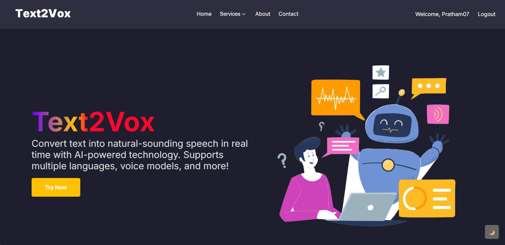
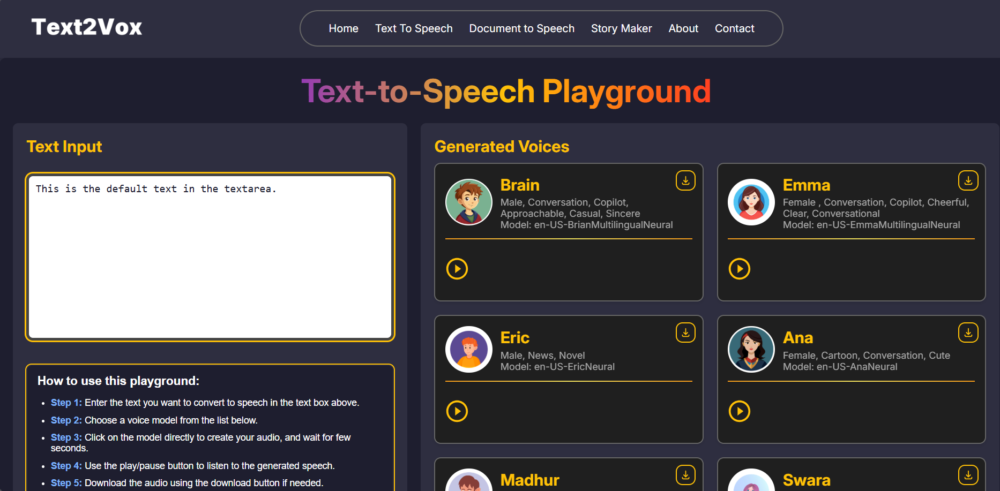
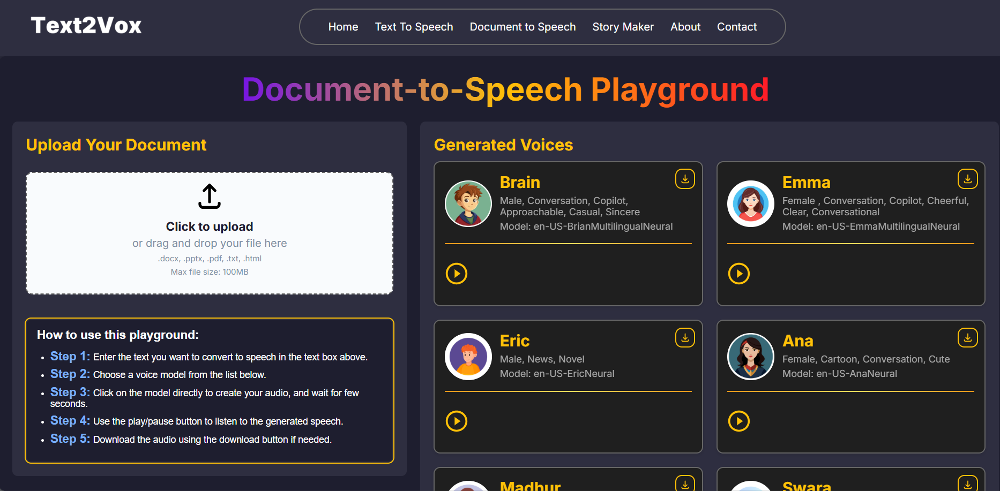

# 🎙️ Text2Vox

**Text2Vox** is a modern, web-based Text-to-Speech (TTS) application built using Flask and Edge-TTS. It allows users to convert text into natural-sounding speech with support for multiple voices, real-time playback, and downloadable MP3 files. Designed with a responsive UI and waveform audio visualization, it's perfect for accessibility tools, storytelling, and language learning.

---



---

## 🚀 Features

- ✅ Real-time text-to-speech conversion
- ✅ Multiple voice models with avatars
- ✅ Downloadable MP3 audio output
- ✅ Waveform audio playback using WaveSurfer.js
- ✅ Responsive and modern web UI
- 🧠 Planned: Image-to-text and PDF-to-text support
- 🧠 Planned: Celebrity voice cloning
- 🧠 Planned: Voice Agent using Deepgram & Groq
- 🧠 Planned: Support for additional audio formats (WAV, OGG, etc.)

---

## 📁 Project Structure

```

Text2Vox/
├── app.py                  # Flask backend logic
├── static/
│   ├── audio/              # Generated audio files
│   └── images/             # UI and demo images
├── templates/
│   └── index.html          # Main HTML interface
├── utils/
│   └── voice\_models.py     # Voice model list with metadata
├── requirements.txt        # Python dependencies
└── README.md               # Project documentation

````

---

## ⚙️ Installation

1. **Clone the Repository**

```bash
git clone https://github.com/your-username/Text2Vox.git
cd Text2Vox
````

2. **Create a Virtual Environment (optional)**

```bash
python -m venv venv
source venv/bin/activate     # Windows: venv\Scripts\activate
```

3. **Install Dependencies**

```bash
pip install -r requirements.txt
```

---

## ▶️ Usage

1. **Run the Flask App**

```bash
python app.py
```

2. Open your browser and go to:

```
http://127.0.0.1:5000
```

3. Enter your text, select a voice, and click “Generate.”

---

## 🛠️ Tech Stack

* **Backend:** Python, Flask, Edge-TTS
* **Frontend:** HTML5, CSS3, JavaScript, WaveSurfer.js
* **Text Extraction (Planned):** pytesseract, PyMuPDF
* **Voice Agent (Planned):** Deepgram, Groq

---

## 📌 Future Enhancements

* [ ] Image-to-text conversion
* [ ] PDF-to-text extraction
* [ ] Celebrity voice cloning interface
* [ ] Voice Agent AI integration
* [ ] Multi-format audio output support
* [ ] User accounts and saved history

---

## 📸 Screenshots

- ✅ Real-time text-to-speech conversion  
  

- ✅ Real-time document-to-speech conversion  


- ✅ Multiple voice models with avatars  
  


## 🤝 Contributing

Pull requests are welcome! For major changes, please open an issue first to discuss what you’d like to change.

---

## 👨‍💻 Author

**Prathmesh Parab**
Final Year BSc IT, Kirti College
GitHub: [Pratham070604]((https://github.com/Pratham070604))

---

